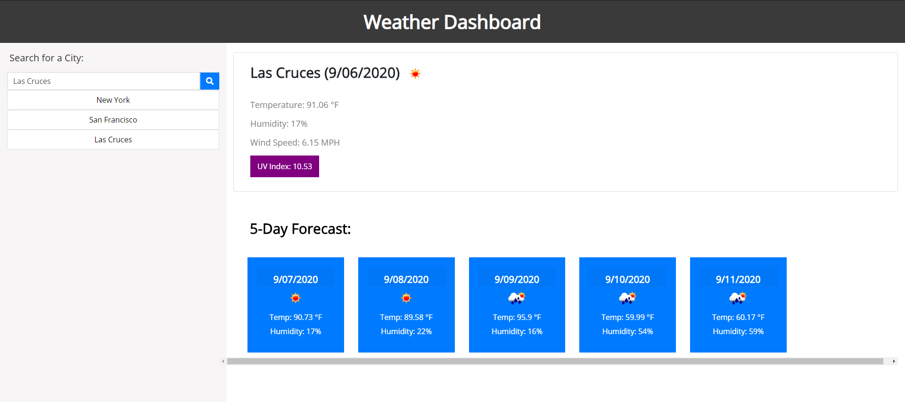

# Weather Dashboard

A weather application that observes the current weather and the projected forcast for the next five days of any city the user inputs. The details of the current weather include temperature, humidity, wind speed, and UV index, while the projected weather only includes the temperature and humidity. User search history is logged in the left column to allow users to easily go back and check the cities they care about. The UV index is also dynamically updated to change color based on the following key: 

Favorable:
Green: <= 2
Yellow: <= 5

Moderate:
Orange: <= 7

Severe:
Red: <= 10
Purple: > 10

Deployed URL: https://joseph-d98.github.io/weather-dashboard/

